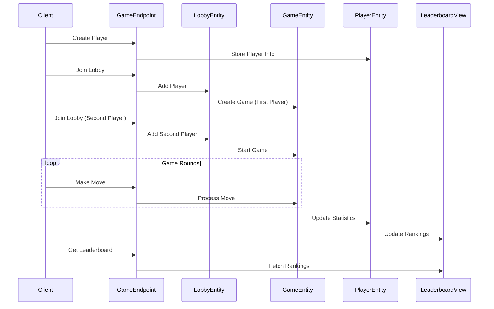
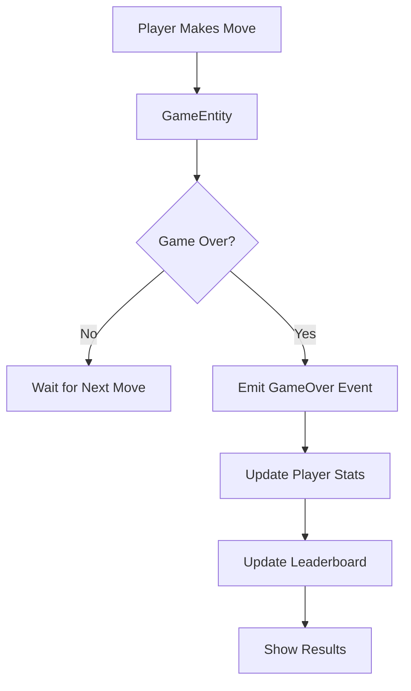
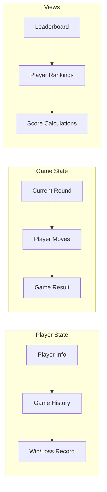
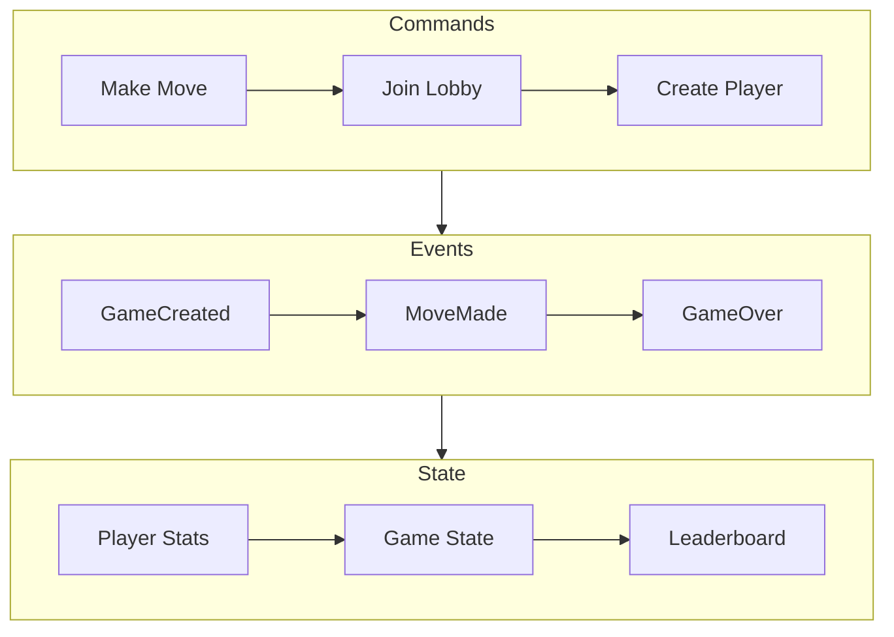

# ROCK-PAPER-SCISSORS

## How to play the game

Rock-Paper-Scissors is a simple hand game played between two people. It's often used to make a quick decision or settle a dispute. The game involves three possible hand signals:

- **Rock**: A closed fist.
- **Paper**: An open hand with fingers extended.
- **Scissors**: A fist with the index and middle fingers extended, forming a V.

### Game Rules

1. **Objective**: Each player chooses one of the three hand signals. The winner is determined by the following rules:
    - Rock crushes Scissors.
    - Paper covers Rock.
    - Scissors cut Paper.

2. **Tie**: If both players choose the same hand signal, the game is a tie, and players must play again.

3. **Gameplay**: Players count to three in unison and then simultaneously show their chosen hand signal. This is often accompanied by a chant like "Rock, Paper, Scissors, Shoot!"

4. **Winning the Game**: The game can be played in rounds, and the first player to win two rounds is declared the overall winner.

Rock-Paper-Scissors is not just a game of chance; it can involve strategy and quick thinking. Enjoy playing and may the best strategist win!

# Architecture Overview

The Rock-Paper-Scissors game is built using Akka's Event Sourcing pattern, leveraging Akka's distributed nature and resilience capabilities. The application consists of several key components that work together to provide the game functionality:

### Core Components

1. **Player Entity** (`PlayerEntity`)
   - Keeps track of player information and statistics
   - Stores wins, losses, and game history
   - Key-Value entity that maintains player state
   - Automatically replicated across regions for resilience

2. **Game Entity** (`GameEntity`)
   - Manages the game state and rules
   - Handles player moves and determines winners
   - Event Sourced entity that maintains complete game history
   - Supports recovery and replay of game events

3. **Lobby Entity** (`LobbyEntity`)
   - Manages player matchmaking
   - Creates games when players join
   - Key-Value entity for temporary lobby state
   - Scales automatically with player demand

4. **Leaderboard View** (`LeaderboardView`)
   - Provides real-time rankings
   - Updates automatically when games complete
   - Materializes player statistics for efficient querying
   - Scales reads independently of writes

### Component Interactions



### Event Flow



### Key Features

1. **Event Sourcing**
   - All game actions are stored as events
   - Game state can be rebuilt from event history
   - Provides audit trail of all moves
   - Enables recovery and replay scenarios

2. **Elastic Scaling**
   - Components scale automatically with demand
   - Active-active replicas positioned close to users
   - Distributed by design across regions
   - Supports multi-region and multi-cloud deployments

3. **Real-time Updates**
   - Game state updates immediately after moves
   - Leaderboard refreshes automatically
   - Player statistics update after each game
   - Low latency through local replicas

4. **Resilience**
   - Self-managed in-memory state
   - Automatic recovery from failures
   - State replication across regions
   - No single point of failure

5. **Agile Operations**
   - Zero-downtime updates
   - Dynamic workload rebalancing
   - Runtime configuration changes
   - Seamless maintenance windows

### State Management



### Data Flow



## Implementation

To understand the Akka concepts that are the basis for this example, see [Development Process](https://doc.akka.io/concepts/development-process.html) in the documentation.


This project contains the skeleton to create an Akka service. To understand more about these components, see [Developing services](https://doc.akka.io/java/index.html). Examples can be found [here](https://doc.akka.io/java/samples.html).


Use Maven to build your project:

```shell
mvn compile
mvn test
mvn verify
```

When running an Akka service locally.

To start your service locally, run:

```shell
mvn compile exec:java
```

This command will start your Akka service. With your Akka service running, the endpoint it's available at:

```shell
http://localhost:9000/
```


You can use the [Akka Console](https://console.akka.io) to create a project and see the status of your service.

Build container image:

```shell
mvn clean install -DskipTests
```

Install the `akka` CLI as documented in [Install Akka CLI](https://doc.akka.io/reference/cli/index.html).

Deploy the service using the image tag from above `mvn install`:

```shell
akka service deploy rock-paper-scissors rock-paper-scissors:tag-name --push
```

Refer to [Deploy and manage services](https://doc.akka.io/operations/services/deploy-service.html)
for more information.

## Example usage with curl

These `curl` commands demonstrate how to interact with the `GameEndpoint` API. Replace `localhost:9000` with the appropriate host and port if your service is running elsewhere.

### Create a Player
To create a new player, use the following command:
```bash
curl -i -X POST http://localhost:9000/game/player -H "Content-Type: application/json" -d '{"id": "player1", "name": "Alice"}'
```

### Get Player Information
To retrieve information about a player, use the following command:
```bash
curl -X GET http://localhost:9000/game/player/player1
```

### Join a Lobby
To join a lobby, use the following command:
```bash
curl -X POST http://localhost:9000/game/lobby/lobby1/join -H "Content-Type: application/json" -d '{"playerId": "player1"}'
```

```bash
curl -X POST http://localhost:9000/game/lobby/lobby1/join -H "Content-Type: application/json" -d '{"playerId": "player2"}'
```

### Get Game State
To retrieve the current state of a game, use the following command:
```bash
curl -X GET http://localhost:9000/game/{gameId}
```

### Make a Game Move
To make a move in a game, use the following command:
```bash
curl -i -X POST http://localhost:9000/game/{gameId}/move -H "Content-Type: application/json" -d '{"playerId": "player1", "move": "ROCK"}'
```
